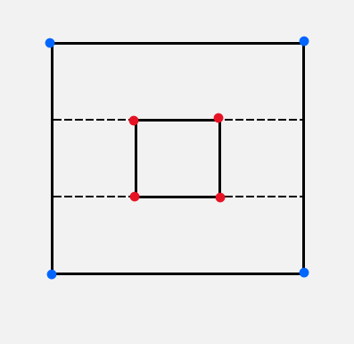

In this example, there is no ***corner line***, so the corresponding bipartite graph of it is empty. Then for those ***internal corners*** which has no line (except the *border*) connected to, we draw a either horizontal or vertical line from them (we use horizontal lines in this example). So,

$$
\begin{aligned}

|R(L_m)|
&= \frac{n}{2} + h - \max \{ |L_c| \} - 1\\
&= \frac{8}{2} + 1 - 0 - 1\\
&= 4

\end{aligned}
$$

