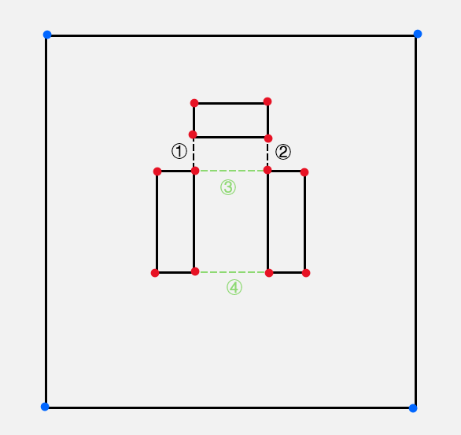
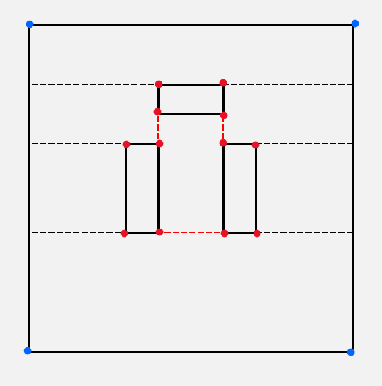

In this example, there are $2$ vertical ***corner lines*** (marked as black), and $2$ horizontal ***corner lines*** (marked as green).

line $\textcircled{3}$ intersect with line $\textcircled{1}$ and line $\textcircled{2}$, so the corresponding bipartite graph looks like

The maximum independent set of it is $S = \{ 1 , 2 , 4 \}$. So we connect line $\textcircled{1}$ $\textcircled{2}$ $\textcircled{4}$ (marked as red). Then for those ***internal corners*** which has no line (except the *border*) connected to, we draw a either horizontal or vertical line from them (we use horizontal lines in this example).

So, the minimal number of rectangles is

$$
\begin{aligned}

|R(L_m)|
&= \frac{n}{2} + h - \max \{ |L_c| \} - 1\\
&= \frac{16}{2} + 3 - 3 - 1\\
&= 7

\end{aligned}
$$

